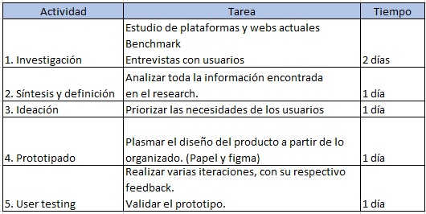
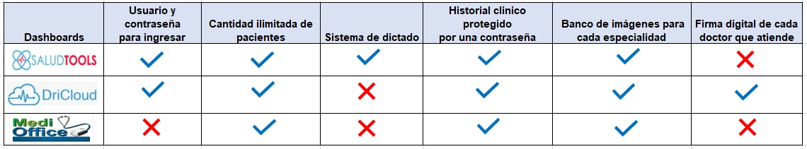
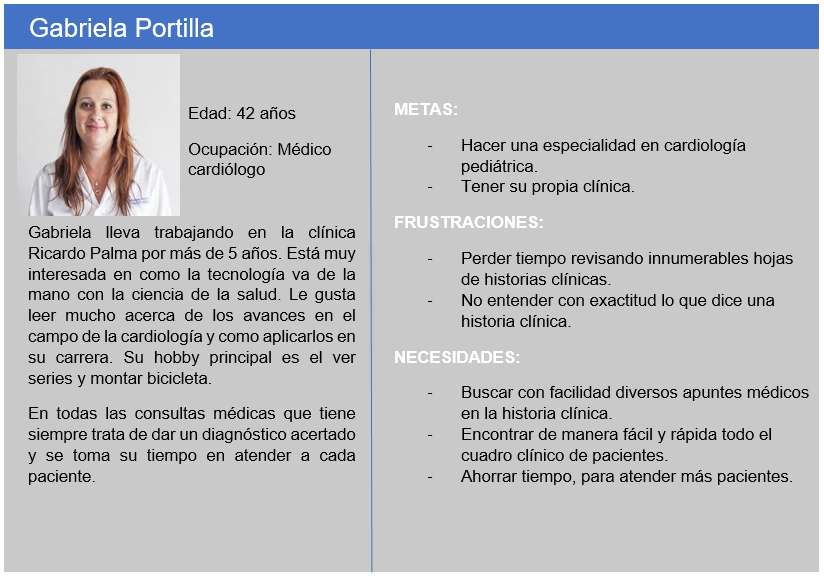

# Dashboard para un médico internista
El dashboard permitirá que el médico de un hospital o clínica pueda ver la información de los pacientes generada por una o más visitas médicas en diversas consultas con distintos especialistas. 

# Objetivo 
Crear un dashboard donde se visualice la historia clínica detallada de cada paciente.

# Desarollo
Para la realizar este reto se seguirá las etapas de diseño centrado en el usuario.

La organización y actividades se realizó de la siguiente manera:

# Descubrimiento e investigación

## Entrevista

Se realizaron entrevistas a profundidad a 3 médicos  para poder recabar información de la manera habitual de rellenar una historia clínica, averiguar cómo se puede agilizar esta  revisión y conocer las diversas opiniones respecto a cómo debería ser una historia clínica electrónica.

**Andrea Torres 34 años – Hospital Grau**

**¿Qué información se encuentra en una historia clínica?**

- Por lo general se encuentra información desde la primera vez que el paciente se hizo atender ya sea que entro por emergencias o consultorio externo.

- Se encuentra: Sus datos básicos, sus enfermedades, exámenes clínicos, diagnósticos y tratamientos.

**¿Cuál es el proceso habitual para rellenar una historia clínica?**

- Se le hace diversas preguntas como, por ejemplo, ¿Cuánto tiempo lleva mal?, si malestar   fue progresivo, ¿En qué parte siente dolor?, entre otras preguntas.

- Se le permite al paciente expresarse libremente de la dolencia que tiene, y algunos puntos importantes se va anotando en la historia.

- Se revisa sus antecedentes, si antes fue atendido por los mismos síntomas, a veces son personas que tienen demasiada información médica y esto toma su tiempo.

- De acuerdo con la información que me dice el paciente y con el tiempo que tengo para revisar el sin fin de hojas escritas de la historia clínica escribo mi diagnóstico y  si es necesario pido exámenes.  

**¿Qué parte de la historia clínica es importante y cuál es la parte que demora más en revisar o rellenar?**

- Lo más importante es ver sus últimas consultas con los médicos, los exámenes que le pidieron y los resultados que obtuvo.

- La parte que demora es la de encontrar si antes ya vino el paciente con la misma dolencia, tener que leer rápido cual son los diagnósticos de mis otros colegas.

**Alguna experiencia que nos pueda comentar que tuvo cuando atendió algún paciente con su historia clínica.**

- Recuerdo que una señora tenía una historia clínica extensa,y algunos doctores por no leer toda la historia, cada vez que visitaba el hospital casi siempre le hacían repetir exámenes clínicos y radiografías. 

**Alguna sugerencia para que al revisar una historia sea rápido y precisa.**

- Toda la historia clínica debería estar en la computadora, así sería más fácil de buscar y encontrar la información del paciente.
- A veces son tantos papeles escritos que aturde, tal vez debería haber un gráfico del cuerpo humano que indique cada dolencia.

**Luis Fernández 35 años – Hospital Edgardo Rebagliati**

**¿Qué información se encuentra en una historia clínica?**

- Se encuentra registrado cronológicamente las condiciones de salud del paciente, durante todas sus visitas médicas al hospital. También se encuentra el diagnostico, pronóstico y tratamiento. 

**¿Cuál es el proceso habitual para llenar una historia clínica?**

- Se le pregunta el motivo de la visita al paciente, y los malestares que tiene.
- Revisar en la historia clínica si el malestar es repetitivo.
- Revisar exámenes médicos anteriores y antecedentes. 
- Anotar el diagnostico

**¿Qué parte de la historia clínica es importante y cuál es la parte que demora más en revisar o rellenar?**

- La parte más importante son los antecedentes médicos previos a la cita y volver a revisar el resultado de los exámenes que se le pidió con anterioridad al paciente.
- Lo que demora más es el leer todo el cuadro clínico del paciente.

**Alguna experiencia que nos pueda comentar que tuvo cuando atendió algún paciente con su historia clínica.**

- En una oportunidad hubo un accidente en el hospital, donde se quemaron varias historias clínicas. No hubo manera de recuperar la información médica que había en todas las hojas quemadas, es más tampoco existía una copia de estas historias. Toda esa información valiosa se perdió tal vez por no haberlo llenado todo a un sistema en la computadora.    

**Alguna sugerencia para que al revisar una historia sea rápido y precisa.**

- Las historias clínicas deberían tener imágenes ya impresas con diversas partes del cuerpo y nosotros indicar donde se encuentra el mal.
- A veces la letra no es legible, sería mejor si esto lo escribiéramos es una tablet o computadora. 

**Jescenia Tovar 41 años – Clínica Javier Prado**

**¿Qué información se encuentra en una historia clínica?**

- Se encuentra hojas de interconsulta, órdenes médicas, informes detallados de los tratamientos, diagnósticos, antecedentes.

**¿Cuál es el proceso habitual para llenar una historia clínica?**

- Se coloca la fecha, hora de la atención 
- Se identifica al paciente 
- Se revisa el cuadro clínico del paciente en la historia clínica.
- Se le pregunta al paciente que es lo que siente y si anteriormente ya vino por lo mismo. 

**¿Qué parte de la historia clínica es importante y cuál es la parte que demora más en revisar o rellenar?**

- Lo más importante es todo el cuadro clínico, donde se muestra las enfermedades y tratamientos del paciente.
- Demora más en buscar el diagnostico de otros doctores, leer lo que colocaron y que exámenes pidieron, y el tratamiento que dieron. 

**Alguna experiencia que nos pueda comentar que tuvo cuando atendió algún paciente con su historia clínica.** 

- En una oportunidad  un paciente tenía una  historia clínica tan extensa, que me tuve que tomar  mi tiempo de leerla y de intentar entender lo que había escrito cada colega, ya que tenía que dar un diagnóstico certero, demore tanto  en esa cita, que mi secretaria tuvo que decirme que aún quedaba como 5 pacientes más por atender.

**Alguna sugerencia para que al revisar una historia sea rápido y precisa.**
- Se debería de dejar de usar el papel, y hacerlo todo a mano.
- Migrar si es posible toda la historia clínica a la computadora.

## Benchmark

# Síntesis y definición

## Identificación de Insights

Por medio de las entrevistas se identifica los siguientes insights:

- Los médicos visualizan en una historia clínica: datos básicos del paciente, tratamientos, exámenes clínicos, resultados y diagnósticos.
- Los médicos necesitan encontrar con rapidez tratamientos y diagnósticos anteriores.
- Los médicos les preocupa no repetir algún examen clínico o radiografía   que ya fue solicitado con anterioridad.
- Los médicos identifican que algunas imagenes ayudarian a entender mejor una historia clínica.

## User persona 

# Ideación

## Feature list

# Prototyping

# Testing

 